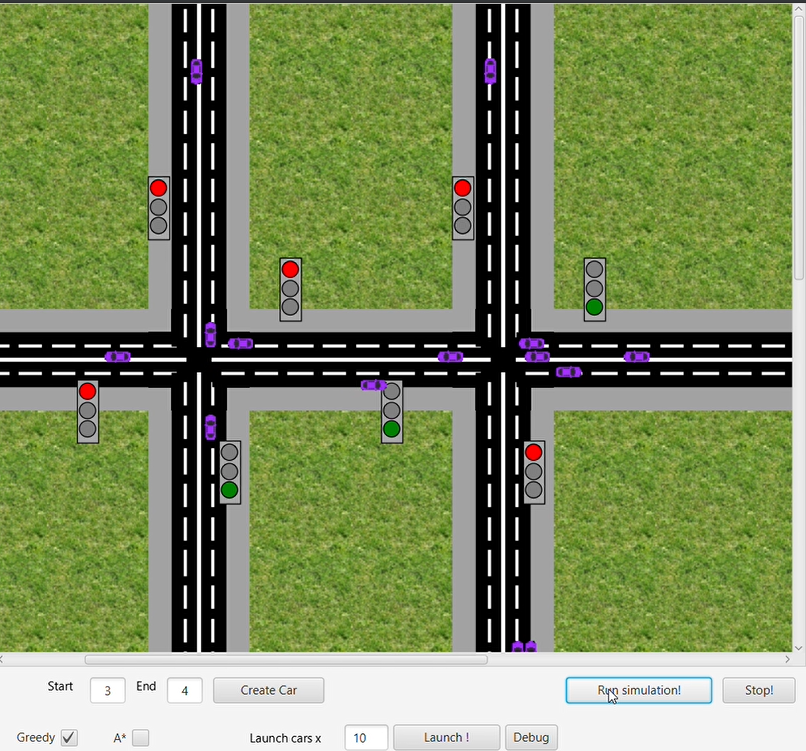
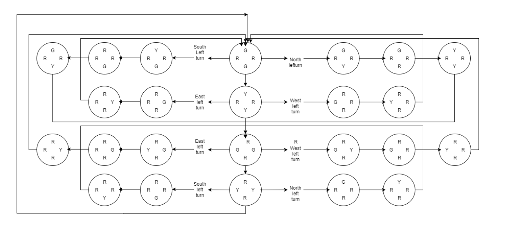

## Intelligent Traffic Control
#### Project 2.2 @ Data Science and Knowledge engineering.

### A simulation that allows to visualize congestions at intersections

“…Using queue minimisation and dynamic traffic lights we can reduce delays for the individual driver and reduce congestion at intersections.”

## Assumptions
* Traffic lights are only created when necessary
* By default opposite traffic lights have same cycle lengths
* Cycle lengths vary based on traffic control strategy
* Only Cross-Sections

## Features
* Algorithms that optimize for total travel time.
* Physics model: Takes into account velocity and max speed of cars.
* Intelligent driver model.
* Multi-lane structure.
* Map creation tool

### Intelligent driver model
* Used to determine car speed and behaviour
* Free road behaviour
  * Road speed limit
  * Current speed
* Behaviour due to obstacle in front
  * Nearest car
  * Red traffic light

### Car generation
* Cars are all initialised with same properties
* Cars can be added by the user during the simulation
* Cars can be generated by car generator
    * Number of cars specified by user
    * Poisson distribution to generate inter-arrival time
    * Cars added to the start of random or fixed lanes and random destinations are chosen

## Technologies used

* **Java**
* **JavaFX**

## Intersection FSM

